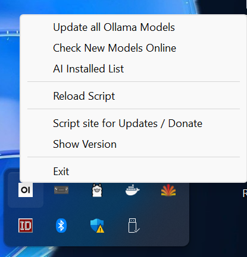
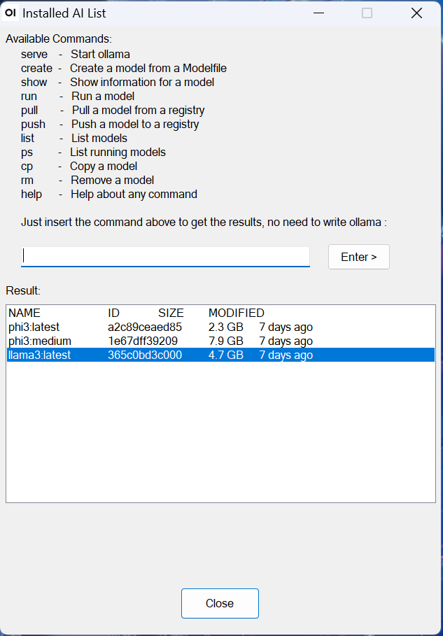
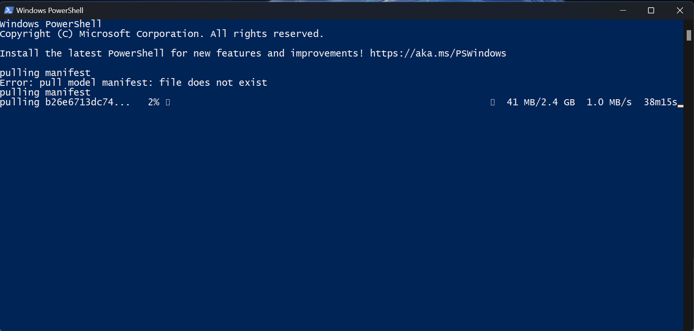

# Ollama - Open WebUI Script

You can download the "Ollama - Open WebUI Script.exe" for Windows from the [releases page](https://github.com/Special-Niewbie/Ollama-Open-WebUI-Script/releases).

## Overview

Ollama - Open WebUI Script is a script program designed to facilitate the opening of Open WebUI in combination with Ollama and Docker. This script simplifies access to the Open WebUI interface with Ollama installed on a Windows system, providing additional features such as updating models already installed on the system, checking the status of models online (on the official Ollama website), displaying the list of available commands, and more.

I created this small program for several reasons: for those like me who do not want to burden their PC at startup with many resources and find themselves having to start Docker, then Ollama, and then Open WebUI. This way, you have more direct and simplified access, less mechanical, to the two wonderful projects in combination Ollama/Open WebUI.

## Main Features

1. **Prerequisites**: You need to have `Docker Desktop.exe` installed with the Open WebUI container and Ollama.exe separately installed on the Windows operating system (if you need a variation of this script that handles another type of installation/combination, let me know).
2. **How Ollama - Open WebUI Script Works**: When started, it checks the status of Docker Desktop and Ollama; if they are not running on the system, it starts Docker Desktop and Ollama, then opens the Open WebUI chat window. The script remains open in the System Tray Icon to allow the user to start a new chat and open Open WebUI by simultaneously pressing the `Windows + a` key.
3. **Model Updates**: In the menu of the System Tray icon, there are various options, including this one, which looks for the latest updates online and updates all the models available/already installed on the system.
4. **Check Models Online**: Checks the status of models online through a direct link to the Ollama library website.
5. **View Command List**: Displays a list of available commands for Ollama, allowing the user to easily perform the desired operations.

## How to Use

1. It can be placed and run from anywhere on the computer, no installation required.
2. Run the program, and it will perform the procedure to start everything necessary and open the first chat of Open WebUI, then remain open in the system tray icon.
3. Use the Ollama - Open WebUI Script menu from the `System Tray Icon` (refer to the images) to access the various features of the script.

## Important Note

As mentioned above, before using the program, ensure that Docker Desktop with the Open WebUI container and Ollama are installed on your operating system. Otherwise, the script will not function as expected.

For more information and to contribute to the development, visit the project's GitHub repository: Ollama - Open WebUI Script.

## Donation
If you enjoy using this script and find it helpful and you have the possibility, please consider making a small donation to support the ongoing development of this and other projects. Your generosity is greatly appreciated!
PayPal:
 

Ko-fi:
 

